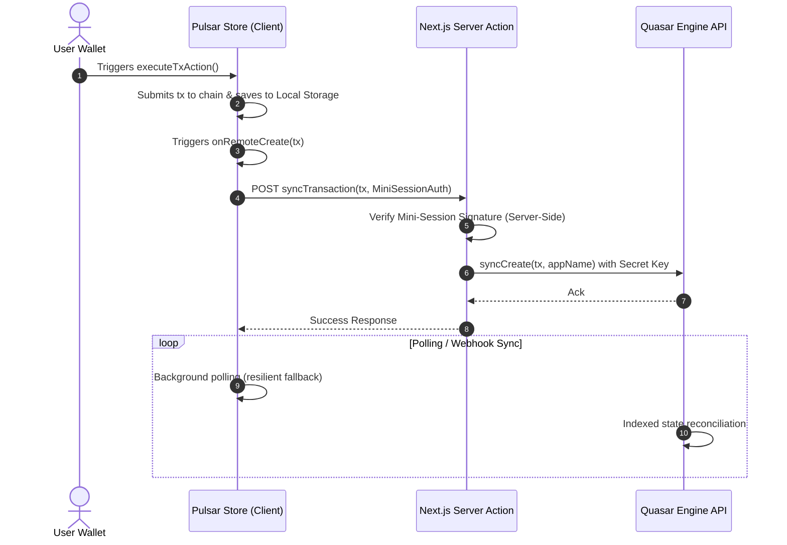

# Quasar SaaS Integration

While the Pulsar suite provides a high-performance, client-centric, headless store to index and track transactions locally, production-grade applications require centralized transaction indexing, audit logs, and organization-scoped webhook deliveries.

To achieve this, the TUWA Ecosystem links **Pulsar (the client-side tracker)** with **Quasar (the cloud-layer indexing engine)**.

---

## Architecture & Data Flow

When integrating Pulsar with Quasar, the local-first engine and the cloud-layer database synchronize via a dual-store topology:

1. **Pulsar Client Store**: Monitors the transaction status directly from the user's browser using local polling adapters.
2. **Quasar Engine**: Verifies and indexes the transactions on the backend, generating immutable billing ledgers and dispatching webhooks.

This workflow uses **Mini-Sessions** on the client side to protect your Quasar private keys and prevent API quota draining.



---

## Step-by-Step Integration

### 1. Network & Wallet Configuration

First, define your application identity, network endpoints, supported EVM chains, and your Wagmi client configuration. Below is a clean, minimal setup using standard `injected()` connectors:

```typescript
// src/configs/appConfig.ts
import { createDefaultTransports } from '@tuwaio/satellite-evm';
import { createConfig, injected } from '@wagmi/core';
import { mainnet, sepolia, polygon, Chain } from 'viem/chains';

export const appConfig = {
  appName: 'TUWA Pulsar & Quasar Integration',
  appDescription: 'Headless multi-chain tracker with secure cloud synchronization',
};

// Endpoints for Solana signature status polling
export const solanaRPCUrls = {
  mainnet: 'https://api.mainnet-beta.solana.com',
  devnet: 'https://api.devnet.solana.com',
};

// Supported EVM networks
export const appEVMChains = [mainnet, sepolia, polygon] as readonly [Chain, ...Chain[]];

// Minimalist Wagmi config containing only the injected connectors
export const wagmiConfig = createConfig({
  connectors: [injected()],
  transports: createDefaultTransports(appEVMChains),
  chains: appEVMChains,
  ssr: true,
});
```

---

### 2. Store Initialization (Client-Side)

Create your Pulsar store and configure the `onRemoteCreate` hook. This hook triggers whenever a new transaction enters the local pool, sending it to the server action for backend synchronization.

```typescript
// src/hooks/usePulsarStore.ts
'use client';

import { createBoundedUseStore, createPulsarStore, createTxInMemoryStore } from '@tuwaio/pulsar-core';
import { pulsarEvmAdapter } from '@tuwaio/pulsar-evm';
import { pulsarSolanaAdapter } from '@tuwaio/pulsar-solana';
import { getMiniSessionAuth } from '@tuwaio/quasar-sdk/react';

import { syncTransaction, getHistory } from '@/app/actions';
import { wagmiConfig, solanaRPCUrls, appEVMChains, appConfig } from '@/configs/appConfig';
import { TransactionUnion } from '@/transactions';

const STORAGE_KEY = 'transactions-tracking-storage-tuwa';

// 1. Initialize the primary persistent Pulsar store
export const initialStore = createPulsarStore<TransactionUnion>({
  name: STORAGE_KEY,
  adapter: [pulsarEvmAdapter(wagmiConfig, appEVMChains), pulsarSolanaAdapter({ rpcUrls: solanaRPCUrls })],
  // Pre-verification hook to check authentication before sending to wallet
  beforeTxProcess: async () => {
    await getMiniSessionAuth();
  },
  // Remote synchronization hook (POST to Quasar)
  onRemoteCreate: async (tx) => {
    try {
      const auth = await getMiniSessionAuth();
      await syncTransaction(tx, auth);
    } catch (err) {
      console.error('[Pulsar Store] Remote sync failed:', err);
    }
  },
});

export const usePulsarStore = createBoundedUseStore(initialStore);

// 2. Initialize the paginated in-memory history store
const pulsarInMemoryStore = createTxInMemoryStore<TransactionUnion>({
  localTransactionsPool: initialStore.getState().transactionsPool,

  // Fetch paginated history from Quasar via server action
  getHistory: async ({ page, walletAddress }) => {
    try {
      const auth = await getMiniSessionAuth();
      const history = await getHistory(
        {
          walletAddress,
          page,
          limit: 10,
          appName: appConfig.appName,
        },
        auth,
      );

      if (!history) return null;

      return {
        ...history,
        docs: history.docs as TransactionUnion[],
      };
    } catch (error) {
      console.error('[Pulsar Store] Failed to fetch history:', error);
      throw error;
    }
  },

  // Once history is pulled from Quasar, inject any pending items into local trackers
  onHistoryFetched: async (remoteTxs) => {
    await initialStore.getState().injectExternalPendingTxs(remoteTxs);
  },
});

// 3. Keep the pagination store in sync with local transactions pool updates
initialStore.subscribe((state) => pulsarInMemoryStore.getState().syncWithLocalPool(state.transactionsPool));

export const usePulsarInMemoryStore = createBoundedUseStore(pulsarInMemoryStore);
```

---

### 3. Server-Side Synchronization Actions

Implement server actions (or backend endpoints) to verify client requests and forward them to Quasar securely.

> [!IMPORTANT]
> Always verify the `MiniSessionAuth` signature on the server to prevent unauthorized users from consuming your API credit quota.

```typescript
// src/app/actions.ts
'use server';

import { MiniSessionAuth, Quasar, Transaction, utils } from '@tuwaio/quasar-sdk';
import { appConfig } from '@/configs/appConfig';

const quasar = new Quasar({
  baseUrl: process.env.NEXT_PUBLIC_QUASAR_API_URL,
  secretKey: process.env.QUASAR_SDK_SK ?? '',
});

/**
 * Synchronizes a client-side transaction with Quasar.
 * Gated by a client-side mini-session signature verification.
 */
export async function syncTransaction(tx: Transaction, authData: MiniSessionAuth) {
  // Validate signature to prevent quota draining
  const isValidSignature = await utils.verifyMiniSession({
    walletAddress: authData.walletAddress,
    signature: authData.signature,
    timestamp: authData.timestamp,
    chainType: authData.chainType,
  });

  if (!isValidSignature) {
    throw new Error('Invalid or expired security signature. Access denied.');
  }

  try {
    // Send transaction to Quasar Engine for cloud indexing and webhook execution
    await quasar.pulsar.syncCreate(tx, appConfig.appName);
    return { success: true };
  } catch (error) {
    console.error('[Quasar Sync] Failed to register transaction:', error);
    throw error;
  }
}

/**
 * Retrieves the organization's transaction history from Quasar.
 */
export async function getHistory(
  params: {
    walletAddress: string;
    page?: number;
    limit?: number;
    chainId?: string;
    status?: string;
    txKey?: string;
    appName?: string;
  },
  authData: MiniSessionAuth,
) {
  const isValidSignature = await utils.verifyMiniSession({
    walletAddress: authData.walletAddress,
    signature: authData.signature,
    timestamp: authData.timestamp,
    chainType: authData.chainType,
  });

  if (!isValidSignature) {
    throw new Error('Invalid or expired security signature. Access denied.');
  }

  try {
    const history = await quasar.pulsar.getHistory(params);
    return history;
  } catch (error) {
    console.error('[Quasar History] Failed to retrieve history:', error);
    throw error;
  }
}
```

---

## Smart Degradation & Recovery

If the Quasar SaaS quota becomes exhausted or the service is temporarily unreachable, Pulsar ensures continuous application execution:

1. The `onRemoteCreate` sync failure is caught and logged, preventing transaction processing errors from propagating to the wallet level (`abortOnTxError` config controls this behavior).
2. The transaction remains in the browser's persistent `localStorage` transaction pool.
3. The local client-side background polling indexers (`evmTracker` or `solanaTracker`) continue monitoring transaction receipt hashes to confirm finalized states locally, guaranteeing zero data loss or visual interruption for the user.
