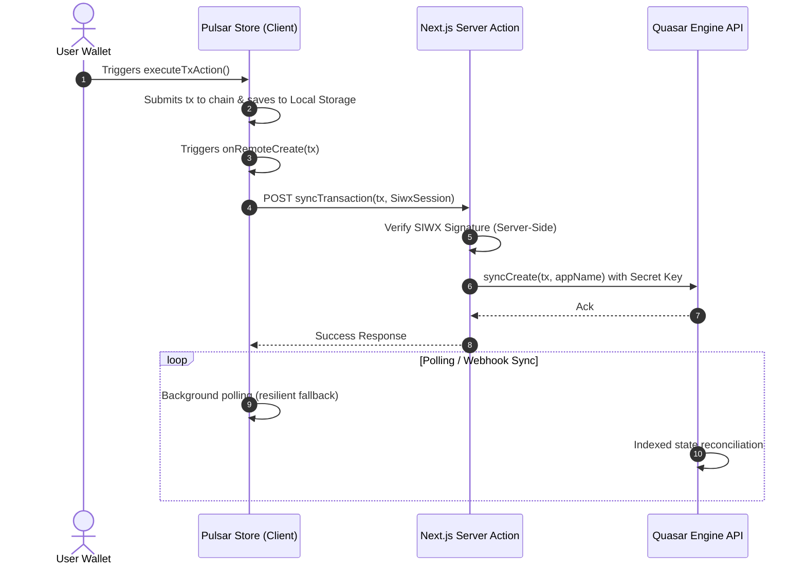

# Quasar SaaS Integration

While the Pulsar suite provides a high-performance, client-centric, headless store to index and track transactions locally, production-grade applications require centralized transaction indexing, audit logs, and organization-scoped webhook deliveries.

To achieve this, the TUWA Ecosystem links **Pulsar (the client-side tracker)** with **Quasar (the cloud-layer indexing engine)**.

---

## Architecture & Data Flow

When integrating Pulsar with Quasar, the local-first engine and the cloud-layer database synchronize via a dual-store topology:

1. **Pulsar Client Store**: Monitors the transaction status directly from the user's browser using local polling adapters.
2. **Quasar Engine**: Verifies and indexes the transactions on the backend, generating immutable billing ledgers and dispatching webhooks.

This workflow uses **SIWX (Sign-In With X) Sessions** on the client side to protect your Quasar private keys and prevent API quota draining.


```mermaid
sequenceDiagram
    autonumber
    actor User as User Wallet
    participant Client as Pulsar Store (Client)
    participant Action as Next.js Server Action
    participant Quasar as Quasar Engine API

    User->>Client: Triggers executeTxAction()
    Client->>Client: Submits tx to chain & saves to Local Storage
    Client->>Client: Triggers onRemoteCreate(tx)
    Client->>Action: POST syncTransaction(tx, SiwxSession)
    Action->>Action: Verify SIWX Signature (Server-Side)
    Action->>Quasar: syncCreate(tx, appName) with Secret Key
    Quasar-->>Action: Ack
    Action-->>Client: Success Response
    loop Polling / Webhook Sync
        Client->>Client: Background polling (resilient fallback)
        Quasar->>Quasar: Indexed state reconciliation
    end
```

---

## Step-by-Step Integration

### 1. Network & Wallet Configuration

First, define your application identity, network endpoints, supported EVM chains, and your Wagmi client configuration. Below is a clean, minimal setup using standard `injected()` connectors:

```typescript
// src/configs/appConfig.ts
import { createDefaultTransports } from '@tuwaio/satellite-evm';
import { createConfig, injected } from '@wagmi/core';
import { mainnet, sepolia, polygon, Chain } from 'viem/chains';

export const appConfig = {
  appName: 'TUWA Pulsar & Quasar Integration',
  appDescription: 'Headless multi-chain tracker with secure cloud synchronization',
};

// Endpoints for Solana signature status polling
export const solanaRPCUrls = {
  mainnet: 'https://api.mainnet-beta.solana.com',
  devnet: 'https://api.devnet.solana.com',
};

// Supported EVM networks
export const appEVMChains = [mainnet, sepolia, polygon] as readonly [Chain, ...Chain[]];

// Minimalist Wagmi config containing only the injected connectors
export const wagmiConfig = createConfig({
  connectors: [injected()],
  transports: createDefaultTransports(appEVMChains),
  chains: appEVMChains,
  ssr: true,
});
```

---

### 2. SIWX Authentication API Route

To securely authenticate wallets and issue sessions for server-side actions, you must set up the SIWX API handler. This handler processes CAIP-122 signatures, verifies them, and manages Secure HttpOnly session cookies.

```typescript
// src/app/api/siwx/[...siwx]/route.ts
import { createSiwxApiHandler } from '@tuwaio/siwx-server/next';

const handler = createSiwxApiHandler({
  cookieOptions: {
    name: 'tuwa-session',
    secure: process.env.NODE_ENV === 'production',
  },
});

// This automatically exposes GET /session, POST /verify, and DELETE /logout (or DELETE /session)
export const { GET, POST, DELETE } = handler;
```

---

### 3. Server-Side Synchronization Actions

Implement server actions (or backend endpoints) to verify client requests and forward them to Quasar securely.

> [!IMPORTANT]
> Always verify the `SiwxSession` signature on the server to prevent unauthorized users from consuming your API credit quota.

```typescript
// src/app/actions.ts
'use server';

import { Quasar, Transaction } from '@tuwaio/quasar-sdk';
import { isSessionMatchingTarget, SiwxClientSession } from '@tuwaio/siwx-core';
import { SiwxSession } from '@tuwaio/siwx-server';
import { appConfig } from '@/configs/appConfig';

const quasar = new Quasar({
  secretKey: process.env.QUASAR_SDK_SK ?? '',
});

/**
 * Synchronizes a client-side transaction with Quasar.
 * Gated by a client-side SIWX session signature verification and target address validation.
 */
export async function syncTransaction(tx: Transaction, session: SiwxClientSession | SiwxSession | null) {
  if (!session) {
    return { success: false, reason: 'unauthenticated' };
  }

  // Verify that the active SIWX session matches the transaction sender address & chain
  if (tx.from && !isSessionMatchingTarget(session, tx.from, tx.chainId)) {
    console.warn('[Quasar Action] Session mismatch for syncTransaction:', {
      sessionAddress: session.address,
      txFrom: tx.from,
    });
    return { success: false, reason: 'session_mismatch' };
  }

  try {
    // Send transaction to Quasar Engine for cloud indexing and webhook execution
    await quasar.pulsar.syncCreate(tx, appConfig.appName);
    return { success: true };
  } catch (error) {
    console.error('[Quasar Sync] Failed to register transaction:', error);
    return { success: false, error: error instanceof Error ? error.message : String(error) };
  }
}

/**
 * Retrieves the organization's transaction history from Quasar.
 * Validates session ownership against target walletAddress.
 */
export async function getHistory(
  params: {
    walletAddress: string;
    page?: number;
    limit?: number;
    chainId?: string;
    status?: string;
    txKey?: string;
    appName?: string;
  },
  session: SiwxClientSession | SiwxSession | null,
) {
  if (!session || !isSessionMatchingTarget(session, params.walletAddress, params.chainId)) {
    return {
      docs: [],
      totalDocs: 0,
      limit: params.limit ?? 10,
      page: params.page ?? 1,
      totalPages: 1,
      hasNextPage: false,
      hasPrevPage: false,
    };
  }

  try {
    const history = await quasar.pulsar.getHistory(params);
    return history;
  } catch (error) {
    console.error('[Quasar History] Failed to retrieve history:', error);
    return {
      docs: [],
      totalDocs: 0,
      limit: params.limit ?? 10,
      page: params.page ?? 1,
      totalPages: 1,
      hasNextPage: false,
      hasPrevPage: false,
    };
  }
}
```

### 4. Store Initialization (Client-Side)

Create your Pulsar store and configure the `onRemoteCreate` hook. This hook triggers whenever a new transaction enters the local pool, sending it to the server action for backend synchronization.

```typescript
// src/hooks/usePulsarStore.ts
'use client';

import { createBoundedUseStore, createPulsarStore, createTxInMemoryStore } from '@tuwaio/pulsar-core';
import { pulsarEvmAdapter } from '@tuwaio/pulsar-evm';
import { pulsarSolanaAdapter } from '@tuwaio/pulsar-solana';
import { useSiwxSessionStore } from '@tuwaio/siwx-react';
import { preFlightTxCheck } from '@tuwaio/quasar-sdk';

import { syncTransaction, getHistory } from '@/app/actions';
import { wagmiConfig, solanaRPCUrls, appEVMChains, appConfig } from '@/configs/appConfig';
import { TransactionUnion } from '@/transactions';

const STORAGE_KEY = 'transactions-tracking-storage-tuwa';

// 1. Initialize the primary persistent Pulsar store
export const initialStore = createPulsarStore<TransactionUnion>({
  name: STORAGE_KEY,
  adapter: [pulsarEvmAdapter(wagmiConfig, appEVMChains), pulsarSolanaAdapter({ rpcUrls: solanaRPCUrls })],

  // Pre-verification hook to check authentication and API quota before sending to wallet
  beforeTxProcess: async () => {
    await preFlightTxCheck();
  },

  // Remote synchronization hook (POST to Quasar)
  onRemoteCreate: async (tx) => {
    try {
      const auth = useSiwxSessionStore.getState().session;
      await syncTransaction(tx, auth);
    } catch (err) {
      console.error('[Pulsar Store] Remote sync failed:', err);
      throw err; // Rethrow to inform pulsar-core that sync failed
    }
  },

  // Optional Gelato Relayer API Key for gasless transactions
  gelatoApiKey: process.env.NEXT_PUBLIC_GELATO_API_KEY,
});

export const usePulsarStore = createBoundedUseStore(initialStore);

// 2. Initialize the paginated in-memory history store
const pulsarInMemoryStore = createTxInMemoryStore<TransactionUnion>({
  localTransactionsPool: initialStore.getState().transactionsPool,
  reconcileUnsyncedTransactions: initialStore.getState().reconcileUnsyncedTransactions,

  // Fetch paginated history from Quasar via server action
  getHistory: async ({ page, walletAddress }) => {
    try {
      const auth = useSiwxSessionStore.getState().session;
      const history = await getHistory(
        {
          walletAddress,
          page,
          limit: 10,
          appName: appConfig.appName,
        },
        auth,
      );

      if (!history) return null;

      return {
        ...history,
        docs: history.docs as TransactionUnion[],
      };
    } catch (error) {
      console.error('[Pulsar Store] Failed to fetch history:', error);
      throw error;
    }
  },

  // Once history is pulled from Quasar, inject any pending items into local trackers
  onHistoryFetched: async (remoteTxs) => {
    await initialStore.getState().injectExternalPendingTxs(remoteTxs);
  },
});

// 3. Keep the pagination store in sync with local transactions pool updates
initialStore.subscribe((state) => pulsarInMemoryStore.getState().syncWithLocalPool(state.transactionsPool));

export const usePulsarInMemoryStore = createBoundedUseStore(pulsarInMemoryStore);
```

### 5. Provider & SIWX Authentication Integration

To tie everything together seamlessly, initialize `SatelliteConnectProvider`, `NovaConnectProvider`, `NovaTransactionsProvider`, and the root `Providers` wrapper in your application layout.

#### A. Nova Transactions Provider (`src/providers/NovaTransactionsProvider.tsx`)

Binds the Pulsar store instance to the UI layer (modals, toasts, and history feeds) and invokes `useInitializeTransactionsPool` to resume tracking pending transactions across page reloads.

```tsx
// src/providers/NovaTransactionsProvider.tsx
'use client';

import { useSatelliteConnectStore } from '@tuwaio/satellite-react';
import { NovaTransactionsProvider as NTP } from '@tuwaio/nova-transactions';
import { getAdapterFromConnectorType } from '@tuwaio/orbit-core';
import { TxInMemoryPagination, useInitializeTransactionsPool } from '@tuwaio/pulsar-core';
import { usePulsarInMemoryStore, usePulsarStore } from '@/hooks/usePulsarStore';

export function NovaTransactionsProvider({ pagination }: { pagination: TxInMemoryPagination }) {
  const initialTx = usePulsarStore((state) => state.initialTx);
  const closeTxTrackedModal = usePulsarStore((state) => state.closeTxTrackedModal);
  const executeTxAction = usePulsarStore((state) => state.executeTxAction);
  const initializeTransactionsPool = usePulsarStore((state) => state.initializeTransactionsPool);
  const activeConnection = useSatelliteConnectStore((state) => state.activeConnection);
  const getAdapter = usePulsarStore((state) => state.getAdapter);
  const transactionsPool = usePulsarInMemoryStore((state) => state.transactionsPool);

  // Resume tracking pending transactions on mount
  useInitializeTransactionsPool({ initializeTransactionsPool });

  return (
    <NTP
      transactionsPool={transactionsPool}
      initialTx={initialTx}
      closeTxTrackedModal={closeTxTrackedModal}
      executeTxAction={executeTxAction}
      connectedWalletAddress={activeConnection?.isConnected ? activeConnection.address : undefined}
      connectedAdapterType={getAdapterFromConnectorType(activeConnection?.connectorType ?? 'evm:')}
      adapter={getAdapter()}
      pagination={pagination}
    />
  );
}
```

#### B. Satellite Connect Providers (`src/providers/SatelliteConnectProviders.tsx`)

Configures wallet connection adapters, connector watchers, SIWX session state synchronization, and `NovaConnectProvider`.

```tsx
// src/providers/SatelliteConnectProviders.tsx
'use client';

import { SatelliteConnectProvider } from '@tuwaio/satellite-react';
import { satelliteEVMAdapter } from '@tuwaio/satellite-evm';
import { satelliteSolanaAdapter } from '@tuwaio/satellite-solana';
import { EVMConnectorsWatcher, NovaConnectProvider, SolanaConnectorsWatcher } from '@tuwaio/nova-connect';
import { useSiwxSessionStore } from '@tuwaio/siwx-react';
import { wagmiConfig, appEVMChains, solanaRPCUrls } from '@/configs/appConfig';
import { usePulsarStore, usePulsarInMemoryStore } from '@/hooks/usePulsarStore';
import { NovaTransactionsProvider } from '@/providers/NovaTransactionsProvider';

export function SatelliteConnectProviders({ children }: { children: React.ReactNode }) {
  const siwxSession = useSiwxSessionStore((s) => s.session);

  const getAdapter = usePulsarStore((state) => state.getAdapter);
  const transactionsPool = usePulsarInMemoryStore((state) => state.transactionsPool);
  const isLoading = usePulsarInMemoryStore((state) => state.isLoading);
  const isError = usePulsarInMemoryStore((state) => state.isError);
  const currentPage = usePulsarInMemoryStore((state) => state.currentPage);
  const hasMore = usePulsarInMemoryStore((state) => state.hasMore);
  const fetchNextPage = usePulsarInMemoryStore((state) => state.fetchNextPage);
  const fetchInitial = usePulsarInMemoryStore((state) => state.fetchInitial);

  const pagination = {
    isLoading,
    isError,
    currentPage,
    hasMore,
    fetchNextPage,
  };

  return (
    <SatelliteConnectProvider
      adapter={[satelliteEVMAdapter(wagmiConfig, appEVMChains), satelliteSolanaAdapter({ rpcUrls: solanaRPCUrls })]}
      autoConnect={true}
    >
      <EVMConnectorsWatcher wagmiConfig={wagmiConfig} siwx={siwxSession ?? undefined} />
      <SolanaConnectorsWatcher siwx={siwxSession ?? undefined} />
      <NovaTransactionsProvider pagination={pagination} />
      <NovaConnectProvider
        appChains={appEVMChains}
        solanaRPCUrls={solanaRPCUrls}
        transactionPool={transactionsPool}
        pulsarAdapter={getAdapter()}
        pagination={pagination}
        siwx={{
          verifier: async (payload) => {
            const res = await fetch('/api/siwx/verify', {
              method: 'POST',
              headers: { 'Content-Type': 'application/json' },
              body: JSON.stringify(payload),
            });
            return res.ok ? res.json() : null;
          },
          onSuccess: (session) => {
            const address = session.address.includes(':') ? session.address.split(':').pop()! : session.address;
            fetchInitial(address);
          },
          onError: (error) => {
            console.warn('[SIWX Auth Error]', error);
          },
        }}
      >
        {children}
      </NovaConnectProvider>
    </SatelliteConnectProvider>
  );
}
```

#### C. Root Application Providers (`src/providers/index.tsx`)

Combines `WagmiProvider`, `QueryClientProvider`, `SatelliteConnectProviders`, and your application state into a single provider hierarchy.

```tsx
// src/providers/index.tsx
'use client';

import { QueryClient, QueryClientProvider } from '@tanstack/react-query';
import { WagmiProvider } from 'wagmi';
import { wagmiConfig } from '@/configs/appConfig';
import { SatelliteConnectProviders } from '@/providers/SatelliteConnectProviders';

const queryClient = new QueryClient();

export function Providers({ children }: { children: ReactNode }) {
  return (
    <WagmiProvider config={wagmiConfig}>
      <QueryClientProvider client={queryClient}>
        <SatelliteConnectProviders>{children}</SatelliteConnectProviders>
      </QueryClientProvider>
    </WagmiProvider>
  );
}
```

---

## Smart Degradation & Recovery

If the Quasar SaaS quota becomes exhausted or the service is temporarily unreachable, Pulsar ensures continuous application execution:

1. The `onRemoteCreate` sync failure is caught and logged, preventing transaction processing errors from propagating to the wallet level (`abortOnTxError` config controls this behavior).
2. The transaction remains in the browser's persistent `localStorage` transaction pool.
3. The local client-side background polling indexers (`evmTracker` or `solanaTracker`) continue monitoring transaction receipt hashes to confirm finalized states locally, guaranteeing zero data loss or visual interruption for the user.
4. Once the transaction reaches a terminal state (Success, Failed, Replaced) or the application is reloaded, the store automatically triggers background reconciliation (`reconcileUnsyncedTransactions`) to self-heal and index the transaction on the Quasar Engine.
