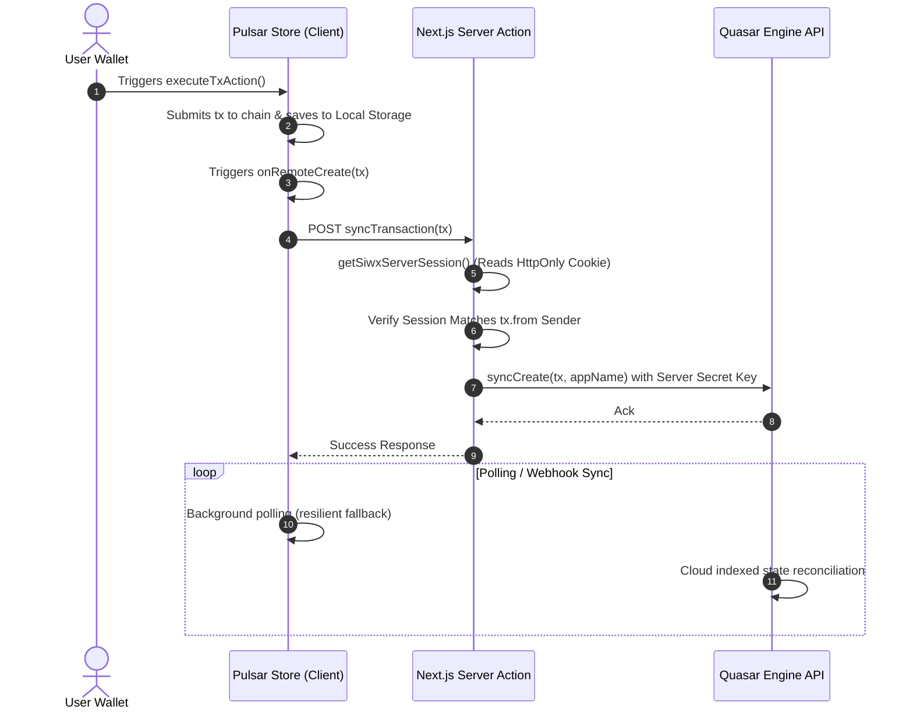

# Quasar SaaS Integration

While the Pulsar suite provides a high-performance, client-centric, headless store to index and track transactions locally, production-grade applications require centralized transaction indexing, audit logs, and organization-scoped webhook deliveries.

To achieve this, the TUWA Ecosystem links **Pulsar (the client-side tracker)** with **Quasar (the cloud-layer indexing engine)**.

---

## Architecture & Data Flow

When integrating Pulsar with Quasar, the local-first engine and the cloud-layer database synchronize via a dual-store topology:

1. **Pulsar Client Store**: Monitors transaction lifecycle events directly from the user's browser using local polling adapters.
2. **Quasar Engine**: Verifies and indexes transactions on the backend, generating immutable billing ledgers and dispatching webhooks.

This workflow uses **SIWX (Sign-In With X) Sessions** stored in Secure `HttpOnly` cookies to protect your Quasar private keys and prevent unauthorized API quota consumption. The client never passes an in-memory session object as an identity proof; authentication is validated server-side on every Server Action.


```mermaid
sequenceDiagram
    autonumber
    actor User as User Wallet
    participant Client as Pulsar Store (Client)
    participant Action as Next.js Server Action
    participant Quasar as Quasar Engine API

    User->>Client: Triggers executeTxAction()
    Client->>Client: Submits tx to chain & saves to Local Storage
    Client->>Client: Triggers onRemoteCreate(tx)
    Client->>Action: POST syncTransaction(tx)
    Action->>Action: getSiwxServerSession() (Reads HttpOnly Cookie)
    Action->>Action: Verify Session Matches tx.from Sender
    Action->>Quasar: syncCreate(tx, appName) with Server Secret Key
    Quasar-->>Action: Ack
    Action-->>Client: Success Response
    loop Polling / Webhook Sync
        Client->>Client: Background polling (resilient fallback)
        Quasar->>Quasar: Cloud indexed state reconciliation
    end
```

---

## 🛡️ Authentication Profiles

The TUWA SIWX ecosystem supports two distinct server integration profiles:

| Profile                           | Target Environment                    | Storage Requirement               | Features                                                                                                     |
| :-------------------------------- | :------------------------------------ | :-------------------------------- | :----------------------------------------------------------------------------------------------------------- |
| **Durable Profile** (Recommended) | Production SaaS & Multi-Replica dApps | Redis / PostgreSQL / Database     | Opaque session tokens, atomic single-use nonce consumption, memory self-healing, instant session revocation. |
| **Stateless Demo Profile**        | Sandboxes, Playgrounds, Landing Demos | Zero Infrastructure (No DB/Redis) | HMAC-SHA256 authenticated cookies, deployment-provided secret key, fail-closed validation.                   |

---

## Step-by-Step Integration

### 1. Network & Wallet Configuration

First, define your application identity, network endpoints, supported EVM chains, and your Wagmi client configuration:

```typescript
// src/configs/appConfig.ts
import { createDefaultTransports } from '@tuwaio/satellite-evm';
import { createConfig, injected } from '@wagmi/core';
import { mainnet, sepolia, polygon, type Chain } from 'viem/chains';

export const appConfig = {
  appName: 'TUWA Pulsar & Quasar Integration',
  appDescription: 'Headless multi-chain tracker with secure cloud synchronization',
};

// Endpoints for Solana signature status polling
export const solanaRPCUrls = {
  mainnet: 'https://api.mainnet-beta.solana.com',
  devnet: 'https://api.devnet.solana.com',
};

// Supported EVM networks
export const appEVMChains = [mainnet, sepolia, polygon] as readonly [Chain, ...Chain[]];

// Wagmi configuration
export const wagmiConfig = createConfig({
  connectors: [injected()],
  transports: createDefaultTransports(appEVMChains),
  chains: appEVMChains,
  ssr: true,
});
```

---

### 2. Backend Auth Stores (`src/lib/authStores.ts`)

> [!NOTE]
> This step is required for the **Durable Profile**. If you are building a zero-infrastructure prototype using the **Stateless Demo Profile**, you can skip this step.

Configure persistent session and nonce stores backed by Redis for atomic single-use nonce consumption and per-wallet active session limits:

```typescript
// src/lib/authStores.ts
import crypto from 'crypto';
import type { SiwxNonceStore, SiwxSession, SiwxSessionRecord, SiwxSessionStore } from '@tuwaio/siwx-server';
import { MemorySiwxNonceStore, MemorySiwxSessionStore } from '@tuwaio/siwx-server';
import Redis from 'ioredis';

const redis = process.env.REDIS_URL ? new Redis(process.env.REDIS_URL) : null;

/**
 * Production Redis durable session store with self-healing LRU eviction.
 */
export class RedisSiwxSessionStore implements SiwxSessionStore {
  private keyPrefix = '{siwx}:session:';
  private maxSessionsPerAddress = 5;

  async create(input: { session: SiwxSession; ttlSeconds: number }): Promise<SiwxSessionRecord> {
    if (!redis) throw new Error('Redis not configured.');
    const id = crypto.randomBytes(32).toString('base64url');
    const now = Date.now();
    const expiresAt = now + input.ttlSeconds * 1000;

    const record: SiwxSessionRecord = {
      id,
      session: input.session,
      createdAt: now,
      expiresAt,
    };

    const key = `${this.keyPrefix}${id}`;
    await redis.set(key, JSON.stringify(record), 'EX', input.ttlSeconds);

    // Enforce per-address session cap to prevent memory bloat
    const addrKey = `{siwx}:addr:${input.session.address.toLowerCase()}`;
    await redis.zadd(addrKey, String(Math.floor(now / 1000)), id);
    await redis.expire(addrKey, input.ttlSeconds);

    const count = await redis.zcard(addrKey);
    if (count > this.maxSessionsPerAddress) {
      const excess = count - this.maxSessionsPerAddress;
      const oldestIds = await redis.zrange(addrKey, '0', String(excess - 1));
      if (oldestIds.length > 0) {
        await redis.del(...oldestIds.map((sid) => `${this.keyPrefix}${sid}`));
        await redis.zrem(addrKey, ...oldestIds);
      }
    }

    return record;
  }

  async get(id: string): Promise<SiwxSessionRecord | null> {
    if (!redis) return null;
    const data = await redis.get(`${this.keyPrefix}${id}`);
    if (!data) return null;

    try {
      const record = JSON.parse(data) as SiwxSessionRecord;
      if (record.expiresAt <= Date.now()) {
        await redis.del(`${this.keyPrefix}${id}`);
        return null;
      }
      return record;
    } catch {
      await redis.del(`${this.keyPrefix}${id}`); // Self-healing on malformed data
      return null;
    }
  }

  async bindSubject(id: string, subjectId: string): Promise<boolean> {
    if (!redis) return false;
    const record = await this.get(id);
    if (!record) return false;
    record.subjectId = subjectId;
    const remainingTtl = Math.max(1, Math.floor((record.expiresAt - Date.now()) / 1000));
    await redis.set(`${this.keyPrefix}${id}`, JSON.stringify(record), 'EX', remainingTtl);
    return true;
  }

  async revoke(id: string): Promise<void> {
    if (redis) await redis.del(`${this.keyPrefix}${id}`);
  }
}

/**
 * Production Redis single-use nonce store.
 */
export class RedisSiwxNonceStore implements SiwxNonceStore {
  private keyPrefix = '{siwx}:nonce:';

  async issue(input: { nonce: string; ttlSeconds: number }): Promise<void> {
    if (redis) await redis.set(`${this.keyPrefix}${input.nonce}`, '1', 'EX', input.ttlSeconds);
  }

  async consume(input: { nonce: string }): Promise<boolean> {
    if (!redis) return false;
    // Atomic single-use consumption via DEL (returns 1 on first use, 0 on replay)
    const deleted = await redis.del(`${this.keyPrefix}${input.nonce}`);
    return deleted === 1;
  }
}

// Export singleton instances (or fallback to in-memory stores in local development)
export const sessionStore: SiwxSessionStore = redis ? new RedisSiwxSessionStore() : new MemorySiwxSessionStore();
export const nonceStore: SiwxNonceStore = redis ? new RedisSiwxNonceStore() : new MemorySiwxNonceStore();
```

---

### 3. SIWX Authentication API Route (`src/app/api/siwx/[...siwx]/route.ts`)

Create a Next.js App Router Route Handler to process CAIP-122 signatures and manage Secure `HttpOnly` session cookies.

#### Option A: Durable Profile (Production SaaS)

```typescript
// src/app/api/siwx/[...siwx]/route.ts
import { createSiwxApiHandler } from '@tuwaio/siwx-server/next';
import { nonceStore, sessionStore } from '@/lib/authStores';

const handler = createSiwxApiHandler({
  sessionStore,
  nonceStore,
  policy: {
    expectedDomain: process.env.SIWX_EXPECTED_DOMAIN || 'app.tuwa.io',
    expectedUri: process.env.SIWX_EXPECTED_URI || 'https://app.tuwa.io',
    allowedChainIds: ['eip155:1', 'eip155:11155111', 'solana:5eykt4UsFv8P8NJdTREpY1vzqKqZKvdpK'],
    requireExpirationTime: true,
    maxIssuedAtAgeSeconds: 300,
  },
  cookieOptions: {
    name: 'siwx-session',
    secure: process.env.NODE_ENV === 'production',
  },
});

export const { GET, POST, DELETE } = handler;
```

#### Option B: Stateless Demo Profile (Zero-Infrastructure)

```typescript
// src/app/api/siwx/[...siwx]/route.ts
import { createStatelessDemoSiwxHandler } from '@tuwaio/siwx-server/next';

const handler = createStatelessDemoSiwxHandler({
  signingSecret: process.env.SIWX_DEMO_SIGNING_SECRET!, // Minimum 32 characters
  policy: {
    expectedDomain: process.env.SIWX_EXPECTED_DOMAIN || 'demo.tuwa.io',
    expectedUri: process.env.SIWX_EXPECTED_URI || 'https://demo.tuwa.io',
    requireExpirationTime: true,
    maxIssuedAtAgeSeconds: 300,
    maxSessionLifetimeSeconds: 1800, // 30 minutes max session
  },
  cookieOptions: {
    name: 'siwx-demo-session',
    secure: process.env.NODE_ENV === 'production',
  },
});

export const { GET, POST, DELETE } = handler;
```

> **Warning**: The Stateless Demo profile is intended exclusively for zero-infrastructure demonstrations and sandbox prototypes. Without a persistent Redis/PostgreSQL storage adapter, atomic nonce single-use enforcement and immediate revocation across horizontal replicas cannot be guaranteed.

---

### 4. Server-Side Synchronization Actions (`src/app/actions.ts`)

Implement server actions to verify client requests and forward them to Quasar securely.

> [!IMPORTANT]
> Always verify the `SiwxSession` on the server by reading the `HttpOnly` cookie via `getSiwxServerSession()`. Never accept client-supplied session objects as proof of identity.

#### Option A: Durable Profile Server Actions

```typescript
// src/app/actions.ts (Durable Profile)
'use server';

import { cookies } from 'next/headers';
import { Quasar, type Transaction } from '@tuwaio/quasar-sdk';
import { isSessionMatchingTarget } from '@tuwaio/siwx-core';
import { getSiwxServerSession } from '@tuwaio/siwx-server';
import { appConfig } from '@/configs/appConfig';
import { sessionStore } from '@/lib/authStores';

const quasar = new Quasar({
  secretKey: process.env.QUASAR_SDK_SK ?? '',
});

async function getVerifiedSession() {
  const cookieStore = await cookies();
  return getSiwxServerSession({
    cookieSource: cookieStore,
    cookieName: 'siwx-session',
    sessionStore,
  });
}

export async function syncTransaction(tx: Transaction) {
  const session = await getVerifiedSession();
  if (!session) {
    return { success: false, reason: 'unauthenticated' };
  }

  // Verify that the active SIWX session matches the transaction sender address & chain
  if (tx.from && !isSessionMatchingTarget(session, tx.from, tx.chainId)) {
    console.warn('[Quasar Action] Session mismatch for syncTransaction:', {
      sessionAddress: session.address,
      txFrom: tx.from,
    });
    return { success: false, reason: 'session_mismatch' };
  }

  try {
    await quasar.pulsar.syncCreate(tx, appConfig.appName);
    return { success: true };
  } catch (error) {
    console.error('[Quasar Sync] Failed to register transaction:', error);
    return { success: false, error: error instanceof Error ? error.message : String(error) };
  }
}

export async function getHistory(params: {
  walletAddress: string;
  page?: number;
  limit?: number;
  chainId?: string;
  status?: string;
  txKey?: string;
  appName?: string;
}) {
  const session = await getVerifiedSession();
  if (!session || !isSessionMatchingTarget(session, params.walletAddress, params.chainId)) {
    return {
      docs: [],
      totalDocs: 0,
      limit: params.limit ?? 10,
      page: params.page ?? 1,
      totalPages: 1,
      hasNextPage: false,
      hasPrevPage: false,
    };
  }

  try {
    const history = await quasar.pulsar.getHistory(params);
    return history;
  } catch (error) {
    console.error('[Quasar History] Failed to retrieve history:', error);
    return {
      docs: [],
      totalDocs: 0,
      limit: params.limit ?? 10,
      page: params.page ?? 1,
      totalPages: 1,
      hasNextPage: false,
      hasPrevPage: false,
    };
  }
}
```

#### Option B: Stateless Demo Profile Server Actions

```typescript
// src/app/actions.ts (Stateless Demo Profile)
'use server';

import { cookies } from 'next/headers';
import { Quasar, type Transaction } from '@tuwaio/quasar-sdk';
import { isSessionMatchingTarget } from '@tuwaio/siwx-core';
import { getSiwxServerSession } from '@tuwaio/siwx-server';
import { appConfig } from '@/configs/appConfig';

const quasar = new Quasar({
  secretKey: process.env.QUASAR_SDK_SK ?? '',
});

async function getVerifiedSession() {
  const cookieStore = await cookies();
  return getSiwxServerSession({
    cookieSource: cookieStore,
    cookieName: 'siwx-demo-session',
    signingSecret: process.env.SIWX_DEMO_SIGNING_SECRET!,
  });
}

export async function syncTransaction(tx: Transaction) {
  const session = await getVerifiedSession();
  if (!session) {
    return { success: false, reason: 'unauthenticated' };
  }

  if (tx.from && !isSessionMatchingTarget(session, tx.from, tx.chainId)) {
    return { success: false, reason: 'session_mismatch' };
  }

  try {
    await quasar.pulsar.syncCreate(tx, appConfig.appName);
    return { success: true };
  } catch (error) {
    console.error('[Quasar Sync] Failed to register transaction:', error);
    return { success: false, error: error instanceof Error ? error.message : String(error) };
  }
}

export async function getHistory(params: {
  walletAddress: string;
  page?: number;
  limit?: number;
  chainId?: string;
  status?: string;
  txKey?: string;
  appName?: string;
}) {
  const session = await getVerifiedSession();
  if (!session || !isSessionMatchingTarget(session, params.walletAddress, params.chainId)) {
    return {
      docs: [],
      totalDocs: 0,
      limit: params.limit ?? 10,
      page: params.page ?? 1,
      totalPages: 1,
      hasNextPage: false,
      hasPrevPage: false,
    };
  }

  try {
    const history = await quasar.pulsar.getHistory(params);
    return history;
  } catch (error) {
    console.error('[Quasar History] Failed to retrieve history:', error);
    return {
      docs: [],
      totalDocs: 0,
      limit: params.limit ?? 10,
      page: params.page ?? 1,
      totalPages: 1,
      hasNextPage: false,
      hasPrevPage: false,
    };
  }
}
```

---

### 5. Client-Side Store Initialization (`src/hooks/usePulsarStore.ts`)

Create your Pulsar store and configure the `onRemoteCreate` hook. This hook triggers whenever a new transaction enters the local pool, delegating synchronization to the server action.

```typescript
// src/hooks/usePulsarStore.ts
'use client';

import { createBoundedUseStore, createPulsarStore, createTxInMemoryStore } from '@tuwaio/pulsar-core';
import { pulsarEvmAdapter } from '@tuwaio/pulsar-evm';
import { pulsarSolanaAdapter } from '@tuwaio/pulsar-solana';
import { preFlightTxCheck } from '@tuwaio/quasar-sdk';

import { syncTransaction, getHistory } from '@/app/actions';
import { wagmiConfig, solanaRPCUrls, appEVMChains, appConfig } from '@/configs/appConfig';
import { type TransactionUnion } from '@/transactions';

const STORAGE_KEY = 'transactions-tracking-storage-tuwa';

// 1. Initialize the primary persistent Pulsar store
export const initialStore = createPulsarStore<TransactionUnion>({
  name: STORAGE_KEY,
  adapter: [pulsarEvmAdapter(wagmiConfig, appEVMChains), pulsarSolanaAdapter({ rpcUrls: solanaRPCUrls })],

  // Pre-verification hook to check authentication and API quota before sending to wallet
  beforeTxProcess: async () => {
    await preFlightTxCheck();
  },

  // Remote synchronization hook (POST to Quasar via Server Action)
  onRemoteCreate: async (tx) => {
    try {
      await syncTransaction(tx);
    } catch (err) {
      console.error('[Pulsar Store] Remote sync failed:', err);
      throw err; // Rethrow to inform pulsar-core that sync failed
    }
  },

  // Optional Gelato Relayer API Key for gasless transactions
  gelatoApiKey: process.env.NEXT_PUBLIC_GELATO_API_KEY,
});

export const usePulsarStore = createBoundedUseStore(initialStore);

// 2. Initialize the paginated in-memory history store
const pulsarInMemoryStore = createTxInMemoryStore<TransactionUnion>({
  localTransactionsPool: initialStore.getState().transactionsPool,
  reconcileUnsyncedTransactions: initialStore.getState().reconcileUnsyncedTransactions,

  // Fetch paginated history from Quasar via server action
  getHistory: async ({ page, walletAddress }) => {
    try {
      const history = await getHistory({
        walletAddress,
        page,
        limit: 10,
        appName: appConfig.appName,
      });

      if (!history) return null;

      return {
        ...history,
        docs: history.docs as TransactionUnion[],
      };
    } catch (error) {
      console.error('[Pulsar Store] Failed to fetch history:', error);
      throw error;
    }
  },

  // Once history is pulled from Quasar, inject any pending items into local trackers
  onHistoryFetched: async (remoteTxs) => {
    await initialStore.getState().injectExternalPendingTxs(remoteTxs);
  },
});

// 3. Keep the pagination store in sync with local transactions pool updates
initialStore.subscribe((state) => pulsarInMemoryStore.getState().syncWithLocalPool(state.transactionsPool));

export const usePulsarInMemoryStore = createBoundedUseStore(pulsarInMemoryStore);
```

---

### 6. Provider & UI Component Integration

Initialize `SatelliteConnectProvider`, `NovaConnectProvider`, and `NovaTransactionsProvider` in your application layout:

#### A. Nova Transactions Provider (`src/providers/NovaTransactionsProvider.tsx`)

```tsx
// src/providers/NovaTransactionsProvider.tsx
'use client';

import { useSatelliteConnectStore } from '@tuwaio/satellite-react';
import { NovaTransactionsProvider as NTP } from '@tuwaio/nova-transactions';
import { getAdapterFromConnectorType } from '@tuwaio/orbit-core';
import { type TxInMemoryPagination, useInitializeTransactionsPool } from '@tuwaio/pulsar-core';
import { usePulsarInMemoryStore, usePulsarStore } from '@/hooks/usePulsarStore';

export function NovaTransactionsProvider({ pagination }: { pagination: TxInMemoryPagination }) {
  const initialTx = usePulsarStore((state) => state.initialTx);
  const closeTxTrackedModal = usePulsarStore((state) => state.closeTxTrackedModal);
  const executeTxAction = usePulsarStore((state) => state.executeTxAction);
  const initializeTransactionsPool = usePulsarStore((state) => state.initializeTransactionsPool);
  const activeConnection = useSatelliteConnectStore((state) => state.activeConnection);
  const getAdapter = usePulsarStore((state) => state.getAdapter);
  const transactionsPool = usePulsarInMemoryStore((state) => state.transactionsPool);

  // Resume tracking pending transactions on mount
  useInitializeTransactionsPool({ initializeTransactionsPool });

  return (
    <NTP
      transactionsPool={transactionsPool}
      initialTx={initialTx}
      closeTxTrackedModal={closeTxTrackedModal}
      executeTxAction={executeTxAction}
      connectedWalletAddress={activeConnection?.isConnected ? activeConnection.address : undefined}
      connectedAdapterType={getAdapterFromConnectorType(activeConnection?.connectorType ?? 'evm:')}
      adapter={getAdapter()}
      pagination={pagination}
    />
  );
}
```

#### B. Satellite Connect Providers (`src/providers/SatelliteConnectProviders.tsx`)

```tsx
// src/providers/SatelliteConnectProviders.tsx
'use client';

import { SatelliteConnectProvider } from '@tuwaio/satellite-react';
import { satelliteEVMAdapter } from '@tuwaio/satellite-evm';
import { satelliteSolanaAdapter } from '@tuwaio/satellite-solana';
import { EVMConnectorsWatcher, NovaConnectProvider, SolanaConnectorsWatcher } from '@tuwaio/nova-connect';
import { useSiwxSessionStore } from '@tuwaio/siwx-react';
import { wagmiConfig, appEVMChains, solanaRPCUrls } from '@/configs/appConfig';
import { usePulsarStore, usePulsarInMemoryStore } from '@/hooks/usePulsarStore';
import { NovaTransactionsProvider } from '@/providers/NovaTransactionsProvider';

export function SatelliteConnectProviders({ children }: { children: React.ReactNode }) {
  const siwxSession = useSiwxSessionStore((s) => s.session);

  const getAdapter = usePulsarStore((state) => state.getAdapter);
  const transactionsPool = usePulsarInMemoryStore((state) => state.transactionsPool);
  const isLoading = usePulsarInMemoryStore((state) => state.isLoading);
  const isError = usePulsarInMemoryStore((state) => state.isError);
  const currentPage = usePulsarInMemoryStore((state) => state.currentPage);
  const hasMore = usePulsarInMemoryStore((state) => state.hasMore);
  const fetchNextPage = usePulsarInMemoryStore((state) => state.fetchNextPage);
  const fetchInitial = usePulsarInMemoryStore((state) => state.fetchInitial);

  const pagination = {
    isLoading,
    isError,
    currentPage,
    hasMore,
    fetchNextPage,
  };

  return (
    <SatelliteConnectProvider
      adapter={[satelliteEVMAdapter(wagmiConfig, appEVMChains), satelliteSolanaAdapter({ rpcUrls: solanaRPCUrls })]}
      autoConnect={true}
    >
      <EVMConnectorsWatcher wagmiConfig={wagmiConfig} siwx={siwxSession ?? undefined} />
      <SolanaConnectorsWatcher siwx={siwxSession ?? undefined} />
      <NovaTransactionsProvider pagination={pagination} />
      <NovaConnectProvider
        appChains={appEVMChains}
        solanaRPCUrls={solanaRPCUrls}
        transactionPool={transactionsPool}
        pulsarAdapter={getAdapter()}
        pagination={pagination}
        siwx={{
          verifier: async (payload) => {
            const res = await fetch('/api/siwx/verify', {
              method: 'POST',
              headers: { 'Content-Type': 'application/json' },
              body: JSON.stringify(payload),
            });
            return res.ok ? res.json() : null;
          },
          onSuccess: (session) => {
            const address = session.address.includes(':') ? session.address.split(':').pop()! : session.address;
            fetchInitial(address);
          },
          onError: (error) => {
            console.warn('[SIWX Auth Error]', error);
          },
        }}
      >
        {children}
      </NovaConnectProvider>
    </SatelliteConnectProvider>
  );
}
```

#### C. Root Application Providers (`src/providers/index.tsx`)

```tsx
// src/providers/index.tsx
'use client';

import { type ReactNode } from 'react';
import { QueryClient, QueryClientProvider } from '@tanstack/react-query';
import { WagmiProvider } from 'wagmi';
import { wagmiConfig } from '@/configs/appConfig';
import { SatelliteConnectProviders } from '@/providers/SatelliteConnectProviders';

const queryClient = new QueryClient();

export function Providers({ children }: { children: ReactNode }) {
  return (
    <WagmiProvider config={wagmiConfig}>
      <QueryClientProvider client={queryClient}>
        <SatelliteConnectProviders>{children}</SatelliteConnectProviders>
      </QueryClientProvider>
    </WagmiProvider>
  );
}
```

---

## Smart Degradation & Recovery

If the Quasar SaaS quota becomes exhausted or the service is temporarily unreachable, Pulsar ensures continuous application execution:

1. The `onRemoteCreate` sync failure is caught and logged, preventing transaction processing errors from propagating to the wallet level (`abortOnTxError` config controls this behavior).
2. The transaction remains in the browser's persistent `localStorage` transaction pool.
3. The local client-side background polling indexers (`evmTracker` or `solanaTracker`) continue monitoring transaction receipt hashes to confirm finalized states locally, guaranteeing zero data loss or visual interruption for the user.
4. Once the transaction reaches a terminal state (Success, Failed, Replaced) or the application is reloaded, the store automatically triggers background reconciliation (`reconcileUnsyncedTransactions`) to self-heal and index the transaction on the Quasar Engine.
